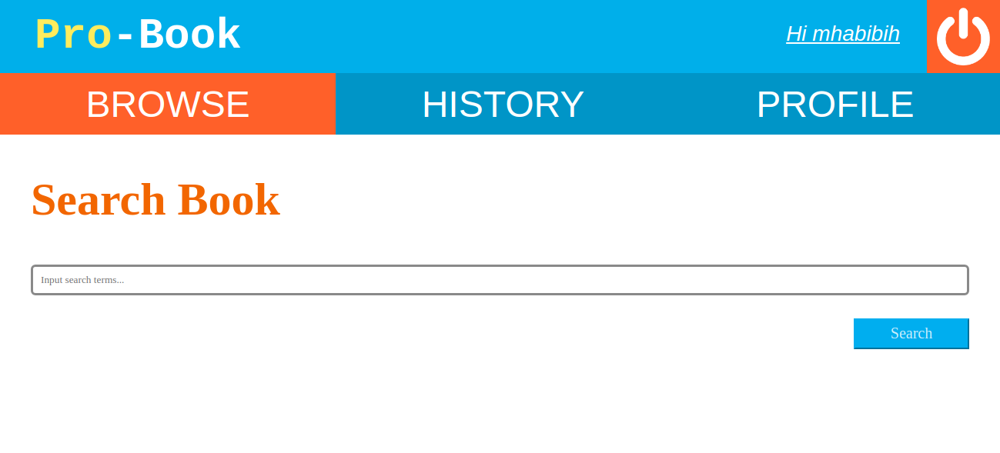

# Pro-Book

## Deskripsi 

Pro-book adalah sebuah *website* untuk melakukan pemesanan dan pembelian buku online. *User* dapat melakukan pemesanan buku, melihat detil buku, dan memberikan *review* terhadap buku yang sudah dibeli.  

## Anggota Tim

1. Adylan Roaffa Ilmy  -  13516016
2. Muhammad Habibi Haidir - 13516
3. Rinda Nur H  - 135161

## Struktur *Source Code*

Secara garis besar, *source code* dibagi menjadi 5 bagian besar, yaitu:

1. **App**
2. **Public**
3. **Util**
4. **Db**
5. **Config**

### App
**App** adalah bagian yang menangani logic dari aplikasi yang dibuat.   
**App** berisi dua bagian utama, yaitu:

1. Controller
2. View

#### Controller
Controller berisi penerapan *logic* fitur-fitur yang terdapat pada aplikasi. Controller mengatur interaksi aplikasi dengan *database* serta pengolahan data yang diperlukan untuk melakukan fitur-fitur yang harus dilakukan oleh aplikasi. Controller menangani *request-request* yang dikirim oleh pengguna untuk 

Controller dibagi menjadi 4 bagian, yaitu : **book** , **review** , **user** , **order**. Bagian-bagian tersebut masing-masing menangani fitur yang berkaitan dengan nama pada bagian tersebut. 

1. **Book** : *Get Book Detail, Search Book*
2. **Review** :  *Add Review, Get Review in Book Detail*
3. **User** : *Register User, Login, Edit Profile, Get Profile Detail, Validate Username, Validate Email*
4. **Order** : *Get Order, Make Order*

Controller bekerja dengan mendapatkan request pada server dan menanganinya sesuai dengan request yang dikirim, dan berinteraksi dengan database sesuai dengan kebutuhan request.

#### View
View berisi tampilan yang akan ditunjukkan pada browser.

1. **login.php** : Tampilan *page* login.
2. **register.php** : Tampilan *page* register.
3. **header.php** : Tampilan template *header* pada *page* yang akan digunakan pada *page* lain.
4. **browse.php** : Tampilan *page* untuk melakukan pencarian buku
5. **searchResult.php** : Tampilan *page* untuk menampilkan hasil pencarian buku
6. **bookDetail.php** : Tampilan *page* detail buku
7. **history.php** : Tampilan *page* yang menampilkan daftar order yang telah dilakukan pengguna
8. **review.php** : Tampilan *page* untuk memasukkan *review* pada sebuah buku.
9. **profile.php** : Tampilan *page* untuk menampilkan detil pengguna.
10. **edit-profile.php** : Tampilan *page* untuk melakukan perubahan data pengguna
11. **logout.php** : Melakukan logout dari akun yang sedang digunakan.

### Public 
Public adalah folder yang dapat diakses langsung oleh pengguna. 

1. **Static** : Folder yang menyimpan  file-file *HTML, CSS, dan Javascript*
2. **index.php** : File utama *website*, semua request yang ada pada website datang dan  diatur oleh file ini. 

### Util
Util berisi fungsi-fungsi pelengkap yang digunakan pada aplikasi. Fungsi-fungsi tersebut adalah sebagai berikut: 

1. **Routing** : Modul untuk mengatur datangnya *request* dan melakukan *routing* ke fungsi yang bersesuaian dengan *request*  
2. **Database.php** : Modul untuk mengatur koneksi ke *database* yang akan digunakan pada modul **Controller**
3. **JWT.php** : Modul untuk membuat *JSON Web Token* untuk disimpan pada cookie untuk proses *authorization* pengguna yang digunakan pada fitur *login*.

## Flow Program

1. Request yang datang akan ditangani oleh file ***index.php*** dan akan dilakukan *routing* ke fungsi yang bersangkutan. 
2. Fungsi yang bersangkutan berupa *Usecase* yang terdefinisi pada modul **Controller**.
3. *Usecase* akan melakukan parsing request dan melakukan pengaksesan ke *database* sesuai dengan kebutuhan fungsi.
4. Hasil data yang diambil dari database kemudian akan dilakukan *render* yang akan menggunakan tampilan yang telah didefinisikan pada modul **View** 

## Hasil Implementasi Program

### Login

*Login* dilakukan dengan mengisi *form* yang ada pada gambar. 

Akan divalidasi terlebih dahulu apakah field username dan password kosong atau tidak. Jika kosong, border akan menjadi warna merah menandakan field tersebut harus diisi terlebih dahulu untuk melakukan login.

Setelah login berhasil, program akan membuat *access token*. Implementasi *access token* dilakukan dengan membuat *JSON Web Token (JWT)*. *JWT* ini akan disimpan pada cookie dengan nama *Authorization* pada browser. *JWT* akan selalu dikirim untuk memverifikasi apakah pengguna merupakan pengguna yang *authorized* untuk melakukan request atau tidak. *JWT* juga berisi *expiry time* yang apabila sudah habis akan langsung melakukan redirect ke *login page* untuk melakukan *login* kembali.

Apabila login gagal, akan mengeluarkan *alert* yang bertuliskan *"Wrong username or password."*

### Register

*Register* dilakukan dengan mengisi *form* yang ada pada gambar.

Semua form harus diisi terlebih dahulu. *Username* harus memiliki panjang paling banyak dua puluh.  *Email* harus berupa format email dan tidak ada email yang sama pada database. Input *Confirm Password* harus sama dengan input *Password*. Panjang *Phone Number* harus di antara 9 hingga 12 karakter. 

Apabila ada *input form* yang salah, *border input* tersebut akan otomastis berganti warna menjadi warna merah.

Apabila ada *form* yang masih salah dan pengguna menekan tombol *Register*, akan muncul *alert* yang bertuliskan *"Please fill in the form with the correct details!"*

### Browse

Halaman untuk pencarian judul buku yang ada pada database. Pengguna harus mengisi *search bar* untuk melakukan pencarian buku. Setelah pengguna mengisi *search bar*, pengguna akan di-*redirect* ke halaman *Search Result*

Apabila *search bar* belum terisi, akan ada peringatan yang mengharuskan untuk mengisi form tersebut. 

### Search Result

Halaman untuk menampilkan hasil pencarian judul buku. Informasi yang ditampilkan adalah cover buku, judul buku, penulis buku, rating buku, dan deskripsi buku tersebut. 

Dari halaman ini, pengguna dapat menekan tombol *detail* untuk pindah ke halaman detail buku.  

### Book Detail

Halaman untuk menampilkan detil buku. Pada halaman ini ditampilkan juga *review* dari pengguna yang telah melakukan *order* pada buku tersebut. Halaman ini juga menampilkan tombol yang dapat digunakan pengguna untuk melakukan pemesanan buku. 

Pengguna harus memilih berapa jumlah buku yang ingin dipesan. Setelah memilih jumlah buku, pengguna dapat menekan tombol **Order** untuk melakukan pemesanan. Apabila *order* berhasil, akan muncul *pop up* yang menandakan bahwa transaksi buku telah berhasil.

### History

Halaman ini menampilkan daftar buku yang telah dipesan oleh pengguna. Informasi yang ditampilkan adalah judul buku, cover buku, jumlah buku, tanggal pemesanan, dan nomor order. 

Pada halaman ini pengguna juga dapat menekan tombol *Review* untuk melakukan *review* pada halaman **Review**.

### Review

Halaman ini berfungsi untuk melakukan *input review* pada buku yang telah dipesan. Input yang dapat dimasukkan adalah memasukkan *rating* yang berupa bintang dan komentar review tersebut. Input komentar juga di validasi, yaitu tidak boleh kosong. 

### Profile

Halaman ini menampilkan detil informasi pengguna. Informasi pengguna yang ditampilkan adalah nama pengguna, *username*, *email*, alamat, dan nomor telepon. Pengguna juga dapat menekan *icon* pensil untuk melakukan pengubahan data pengguna.

### Edit-Profile

Pada halaman ini, pengguna dapat mengubah nama yang ditampilkan, alamat, nomor telepon, dan foto profil. Semua input tidak boleh kosong. Setelah semua input valid, pengguna dapat menekan tombol *Save* dan pengguna akan di-*redirect* ke *profile* lagi.
 
### Pembagian Tugas

**Tampilan**
1. Login : 13516016
2. Register : 13516016
3. Browse : 13516085
4. Search Result :  13516085
5. Book Detail : 13516085, 13516151
6. History : 13516085, 13516151
7. Review : 13516085, 13516151
8. Profile : 13516016
9. Edit Profile : 13516016

**Fungsionalitas**
1. Login : 13516016
2. Access Token : 13516016
3. Register : 13516016
4. Browse (Search Book) : 13516085
5. Search Result : 13516085
6. Book Detail : 13516085
7. History : 13516151
8. Review : 13516085
9. Profile : 13516016
10. Edit Profile : 13516016

## About

**Weird Genius**

Adylan Roaffa Ilmy | M. Habibi Haidir | Rinda Nur H.

